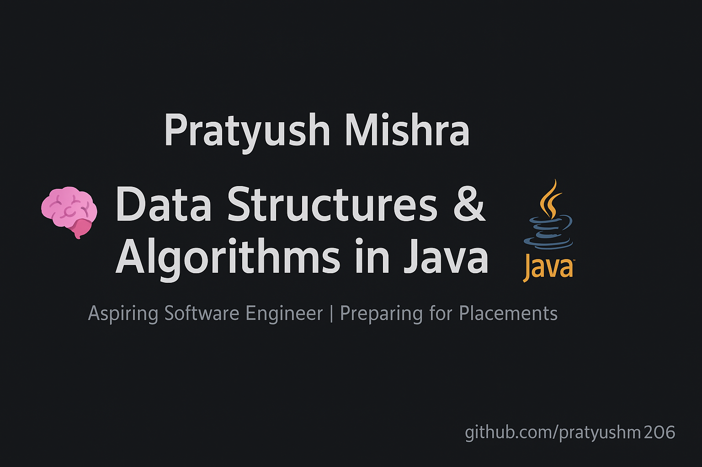

<p align="center">
  
</p>

<h1 align="center">🧠 Data Structures and Algorithms in Java</h1>

<p align="center">
  <b>Mastering DSA in Java | Preparing for Placements</b><br>
  <i>A clean, structured, and practical approach to mastering core DSA concepts.</i>
</p>

---

### 📘 About This Repository
This repository contains my **Java-based Data Structures and Algorithms (DSA)** practice programs.  
Each topic is organized neatly into folders with readable code, logical implementations, and problem-based learning.  

> 🎯 **Goal:** To master DSA in Java and strengthen problem-solving skills for placements.  
> 👨‍💻 **Currently Learning From:** Various online resources and courses (Apna College, Kunal Kushwaha, TakeUForward, etc.)

---

### ⚙️ Tech Stack
<p align="center">
  
  
  
</p>

---

### 🗂️ Folder Structure

```text
Java/
 ┣ Array & ArrayList/
 ┣ Basic/
 ┣ Divide And Conquer/
 ┣ Linked List/
 ┃ ┣ SinglyLL/
 ┃ ┗ DoublyLL/
 ┣ Maths/
 ┣ OOPS Concepts/
 ┣ Questions/
 ┣ Recursion/
 ┣ Searching & Sorting/
 ┣ String/
```

### 🚀 Topics Covered
✅ Arrays & ArrayList  
✅ Linked Lists (Singly & Doubly)  
✅ Recursion & Backtracking  
✅ Searching & Sorting  
✅ Divide and Conquer  
✅ Strings and Mathematics  
✅ OOPS Concepts  

---

### 🧩 Example Problem

**File:** `Linked List/SinglyLL/CreatingLL.java`  
**Description:** Implementation of a singly linked list in Java.  
**Approach:** Uses a `Node` class with `data` and `next` reference.  
**Complexity:** O(n)

---

### 💡 How to Run
```bash
# Compile
javac Filename.java

# Run
java Filename

```
---

### 🏆 LeetCode Profile
<p align="center">
  <a href="https://leetcode.com/u/pratyushm206/" target="_blank">
    
  </a>
</p>

---

### 🧠 Future Goals
- Implement advanced topics like:
  - Trees (Binary, BST, AVL)
  - Graphs and Traversals
  - Dynamic Programming
  - Greedy Algorithms
- Start competitive programming challenges.

---

### 🧑‍💻 Author

**Pratyush Mishra**  
> Aspiring Software Engineer&nbsp;|&nbsp;Focused on mastering Java and Algorithms  
🎓 **B.Tech CSE (AI & ML)**  
📍 **India**  
🔗 [GitHub](https://github.com/pratyushm206) • [LeetCode](https://leetcode.com/u/pratyushm206/)

---

### 🌟 Support
If you find this repository helpful, please give it a ⭐ on GitHub —  
it helps others discover it and motivates me to keep improving 💪


